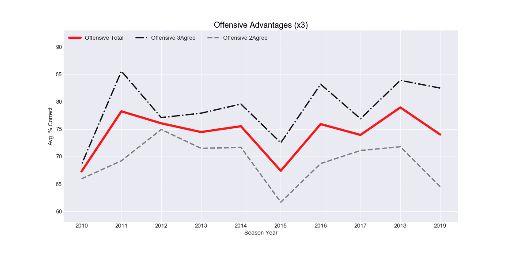

# Final Project
Solo team

# Links
- PickSys repo: https://github.com/amnichols93/PickSys
- PickSys gitpage: https://amnichols93.github.io/PickSys/
- Presentation Slides: https://docs.google.com/presentation/d/1BMbp83ryxox5Rm0n8Au2fhnJJwBQ1P3ISek7oBGqSko/edit?usp=sharing

# Goal of this Project:
- Identify/create a model or combination of models that can predict weekly wins in the NFL regular season with at least 71% accuracy.

# Results
## Model(s)
- Model 1: I have developed a model that evaluates three metrics for predicting a winner for each match. The first metric is how well each team performs in that week of each season. The second metric is how well the teams have performed against each other in the past. The third metric is a statistical breakdown of offensive and defensive advantages for the current season and how well the teams tend to perform when at an advantage or disadvantage (i.e. some teams may have the statistical disadvantage, but the analysis shows that they tend to perform better as the underdog, thus turning those disadvantages into an advantage). If at least two of the three metrics agree, the model predicts that team to win and grades the prediction based on how many metrics agreed (L2 or L3).
- Model 2: I have developed a second model that is designed to "check" the first model. This second model compares predictions from prior weeks with the true winners for each game and identifies any teams that are consistently over- or underestimated. Based on this second model, I make a second set of predictions and override any game that I think the first model will get wrong. I may also override a prediction if there is a major injury on a team that I feel the model is not taking into consideration. All overridden predictions are ranked L1, since it relies on my personal judgement (even though that judgement is, in part, based on data).

## Findings
Model 1, when applied to every game played since the 2010 season, has an overall accuracy rating of 75.2%. There is no single season with an overall accuracy rating less than 70%. There are individual weeks with lower accuracy ratings, but if the model is strictly followed for an entire season, the model should yield at least 70% accuracy.

When offensive advantages were weighted more heavily than defensive advantages, and vice versa, the overall model performed weaker than when the offense and defensive units are evaluated evenly. Moreover, there is almost no difference between the "offensive" model and the "defensive" model. There is no particular advantage, based on this model, to having an offense- or defense-based team.

Model 2 was developed between weeks 5 and 6 of the 2020 regular season, so it currently only has one week of implementation. That said, there was only one prediction from Model 1 that was unlikely based on the findings in Model 2 (Bengals vs. Colts: Model 1 predicted the Bengals), and Model 2 correctly predicted the Colts. Therefore, Model 2 is, so far, a valid "check" on Model 1.

# Notes on Document Organization
Order of operations for using the jupyter notebooks:
- First, I used the "compiling" notebook to import all of the 2010-2019 data. This notebook no longer needs to be referenced as new data becomes available.
- Second, I used the "updating" notebook to append the 2020 data, and I continue to update/run this notebook each week.
- Third, I used the "modeling" notebook to scale and encode the data, and then run the built-in machine learning models. These turned out to be relatively inaccurate, so I no longer run this notebook.
- Fourth, I used the "SQL" notebook to create a relational database between team names and team ID
- Lastly, I use the "analyzing" notebook to determine weekly predictions and update accuracy figures. This notebook reincorporates the SQL database tables.

Directory Tree:
- The folders should all be placed on level further away from the jupyter notebooks in a folder called "Resources"

# Prior Updates
## Update for Segment 3:
- Presentation on Google Slides has been updated to reflect the new model accuracy numbers and updated visualizations based on an adjustment in the code.
- There is now a secondary model that can be used to find weaknesses/blindspots in the primary model. The secondary model identifies if there are any teams that are consistently over- or underestimated by the primary model. I used this secondary model to override my primary model's prediction that the Bengals would beat the Colts this week. The secondary model indicated that the Bengals have been overestimated by the model and the Colts have been underestimated, so I overrode the prediction and, as anticipated, the Colts won.
- I now have a second repo for the website aspect of this project. I have purposefully separated these repos because I do not want people to have access to the code, in the event that I plan to commodify my algorithm, and gitpages requires me to keep the published repo "public." As soon as this course is over, I am going to make this repo private and use it only to log the code while the product of this code is visualized in the other repo.
- Link to other repo: https://github.com/amnichols93/PickSys
- Link to gitpage: https://amnichols93.github.io/PickSys/

## Update for Segment 2:
Presentation Slides: https://docs.google.com/presentation/d/1BMbp83ryxox5Rm0n8Au2fhnJJwBQ1P3ISek7oBGqSko/edit?usp=sharing
This presentation offers an update on the project so far. Some slides only include key words, since I don't plan on presenting with a lot of text on the screen.

## Preliminary README.md for Segment 1:

The goal of this final project is to predict the weekly outcomes of NFL games for the remainder of the season with at least 71% accuracy, and to present these weekly predictions on a website via gitpages.

The reason I chose 71% as the target accuracy is because I am currently in a weekly pool for straight wins and the season leader has an accuracy rating of 70.88%.

### Steps to complete this project:
- Download weekly data for the last ten years of each franchise (from Pro Football Reference, cited in each team's section of the "Compiling" notebook)
- Edit those Excel files so they are compatible with csv format
- Load the csv files into a jupyter notebook
- Add coaching staff (from Pro Football Reference) and starting quarterback data (from Wikipedia) to each franchise's dataframe
- Create master dataframe from each franchise's individual database
- Refine the values as needed (some columns may prove to be useless or a hinderance on the machine learning model)
- Run the data through the machine learning model using different models and encoding techniques to achieve the highest accuracy rate
- Create the html file and display the data/predictions by week (this will be where the visualizations are displayed)

### Current Status
As of the Segment 1 submission, I have the code written for compiling the franchise data and for processing the master dataframe through some machine learning models, however I still need to download/reformat the csv files for 6 out of 32 teams so I can actually save the master dataframe.
